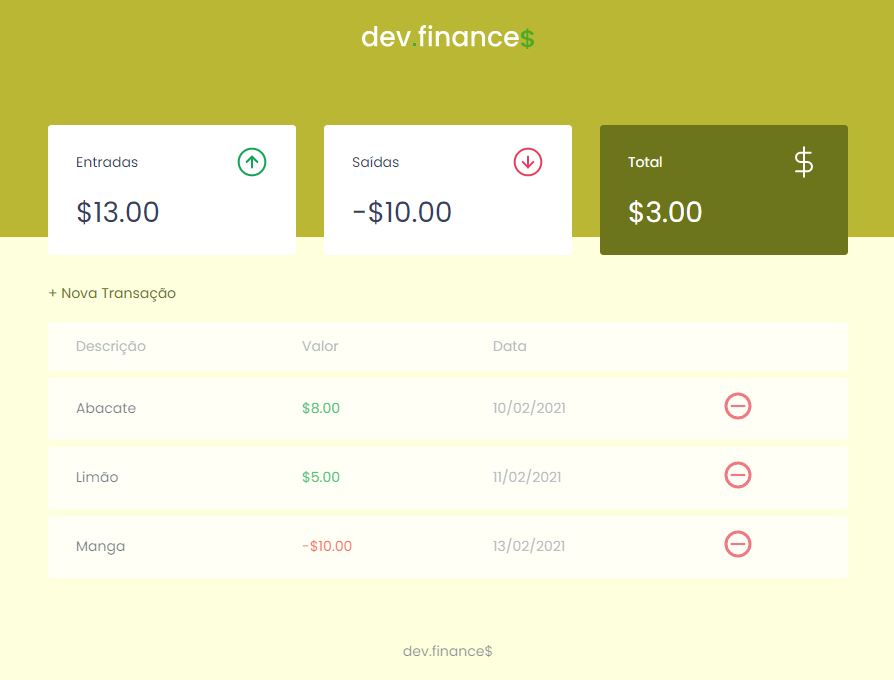
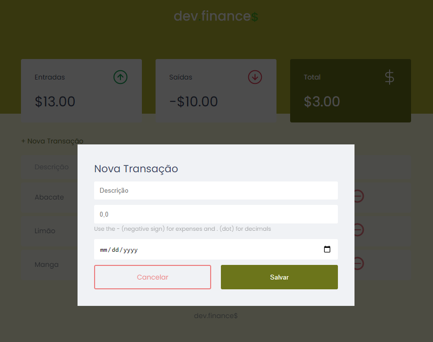

# Maratona Discover 1.0

Projeto desenvolvido pelo: [Mayk Brito](https://github.com/maykbrito). Com o objetivo de passar princípios básicos de HTML, CSS e JavaScript.

 

<h1 align="center">
  
</h1>

  <a href="#-tecnologias">Tecnologias</a>&nbsp;&nbsp;&nbsp;|&nbsp;&nbsp;&nbsp;
  <a href="#-projeto">Projeto</a>&nbsp;&nbsp;&nbsp;|&nbsp;&nbsp;&nbsp;
  <a href="#-deployment">Deployment</a>&nbsp;&nbsp;&nbsp;|&nbsp;&nbsp;&nbsp;
  <a href="#-layout">Layout</a>&nbsp;&nbsp;&nbsp;|&nbsp;&nbsp;&nbsp;
  <a href="#memo-licença">Licença</a>

## Home Page

## Modal Overlay

## 🚀 Tecnologias

Esse projeto foi desenvolvido com as seguintes tecnologias:

- HTML
- CSS
- JavaScript

## 💻 Projeto

O dev.finances é uma aplicação de controle financeiro, onde é possível cadastrar e excluir transações e ver o saldo de entrada e saída 💰

## 🤖 Deployment

Deploy no Vercel APP nos seguintes links:

- [Link 1](https://maratona-discover-01-chi.vercel.app)
- [Link 2](https://maratona-discover-01.arielcarv.vercel.app)
- [Link 3](https://maratona-discover-01-git-main.arielcarv.vercel.app)
  
## 🔖 Layout

Você pode visualizar o layout do projeto através [desse link](https://www.figma.com/file/7Vu9DzUaCZIV4nibzkjgB4/dev.finance%24-Maratona-Discover). É necessário ter conta no [Figma](https://figma.com) para acessá-lo.

## :memo: Licença

Esse projeto está sob a licença MIT. Veja o arquivo [LICENSE](LICENSE.md) para mais detalhes.

--- 
### Créditos

Feito com ♥ by Rocketseat :wave: [Participe da comunidade!](https://discordapp.com/invite/gCRAFh)

